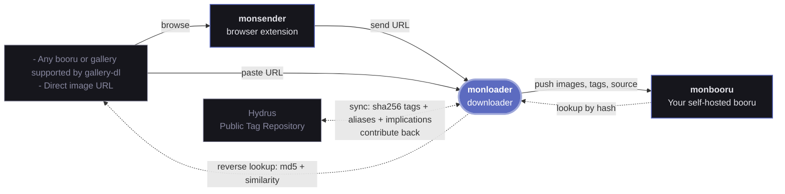

# monloader

Download images from the web into [monbooru](https://github.com/monbooru/monbooru) and backfill tags for the files already in it.

Paste a direct URL, an image or search from an online booru/gallery or [any site supported by gallery-dl](https://github.com/mikf/gallery-dl/blob/master/docs/supportedsites.md) and monloader fetches the files and per-post metadata, maps it onto monbooru's data model, and pushes each file into a monbooru gallery over the REST API.

It also runs in reverse: for a file monbooru already holds, monloader looks up its tags by md5 and by image similarity (iqdb, SauceNAO) across the boorus and/or from an optional local copy of the [Hydrus Public Tag Repository](https://hydrusnetwork.github.io/hydrus/PTR.html), and applies them to the image.

<table>
  <tr>
    <td></td>
    <td></td>
  </tr>
</table>

---

## Features

- **Download images** A direct link to an image, or anything else a gallery-dl extractor matches : booru post, pool, tag search, artist page. 
- **Pools and manga.** A booru pool's pages import as an ordered collection; a manga or comic gallery bundles into a single `.cbz` for monbooru's reader.
- **Metadata mapped to monbooru.** Tags by category (artist / character / copyright / meta / ...), rating, and source, normalized across booru families so tags land the way monbooru expects them.
- **Any gallery-dl site.** 50+ shipped profiles for the booru families and manga/comic sites, and everything else gallery-dl supports works through a generic fallback.
- **Update gallery-dl.** When a site fix lands in a gallery-dl release, install it (or roll back) without waiting for a monloader image.
- **Queue management.** Each download shows whether it was added, was already in your library, got skipped, or failed so you can see at a glance what happened to every item. 
- **Find tags by file hash or image similarity.** Paste an image's md5 to import the matching booru post, or have monbooru fetch tags for a file it already holds; monloader walks the sources you pick in order: exact md5 searches, plus iqdb and SauceNAO similarity lookups that find re-encoded copies from the image's thumbnail. An optional local copy of the Hydrus Public Tag Repository adds offline sha256 lookups.

---

## Related applications

monloader is a companion downloader for monbooru. It fetches images from the web and pushes them into your library :



- **[monbooru](https://github.com/monbooru/monbooru)** : self-hosted booru; organizes, tags, and serves your collection.
- **monloader** : this application; fetches files and per-post metadata (via gallery-dl) and pushes them into a monbooru gallery over the REST API; also answers monbooru's reverse lookups (boorus, IQDB/SauceNAO, Hydrus PTR) and source refetches.
- **[monsender](https://github.com/monbooru/monsender)** : browser extension; sends the URL of the page you're currently browsing to monloader.

---

## Quick start

monloader ships in monbooru's `docker/docker-compose.yml` :

1. Uncomment the `monloader` service in monbooru's compose and start it:
   ```bash
   docker compose up -d monloader
   ```
2. Open monloader at `http://localhost:8081`, go to **Settings -> pairing**, and click **connect to monbooru** (the default api url in the monbooru section, `http://monbooru:8080`, works on the shared compose network).
3. In monbooru, approve the pairing request in its monloader settings. monloader stores the token monbooru issues; there are no keys to copy by hand.
4. Back in monloader, pick a **default gallery** and **save**.
5. Paste a URL into the command bar on the home screen and press Enter.

See the [monloader documentation](https://monbooru.github.io/mondocs/addons/monloader/index.html) for help.

---

## Warning

> **Intended for local network use.** monloader's UI is not designed to be exposed to the public internet.

---

## Acknowledgements

See [monbooru's acknowledgements](https://github.com/monbooru/monbooru#acknowledgements).
